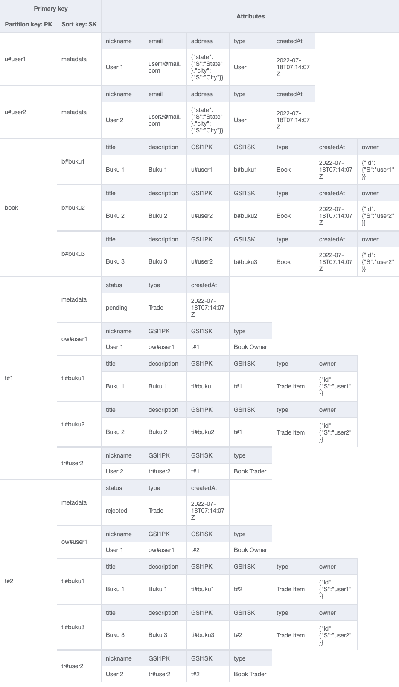
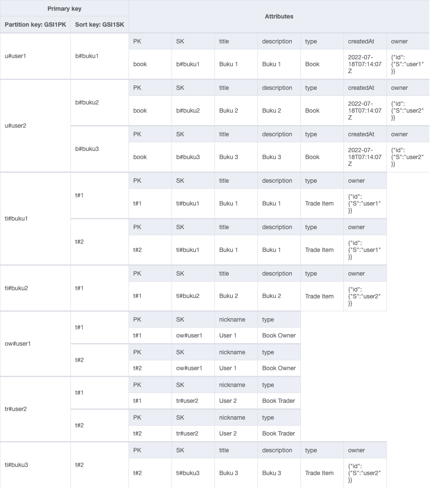

# Access Pattern

## Pseudocode

| Access Patterns                                       | Index | Key Condition                               | Filter Expression | Example                                   |
| :---------------------------------------------------- | :---- | :------------------------------------------ | :---------------- | :---------------------------------------- |
| 1. Get user for a given userId                        | Table | PK=u#userId and SK="metadata"               | -                 | PK="u#u1" and SK="metadata"               |
| 2. Get book for a given bookId                        | Table | PK='book' and SK=b#bookId                   | -                 | PK="book" and SK="b#b1"                   |
| 3. Get trade for a given tradeId                      | Table | PK=t#tradeId and SK="metadata"              | -                 | PK="t#t1" and SK="metadata"               |
| 4. Get all books                                      | Table | PK='book' and SK=begin_with 'b#'            | -                 | PK="book" and SK=begin_with 'b#'          |
| 5. Get all books for a given userId                   | GSI1  | GSI1PK=u#userId and GSISK=begin_with 'b#'   | -                 | GSI1PK="u#u1" and GSISK=begin_with 'b#'   |
| 6. Get all books for a given tradeId                  | Table | PK=t#tradeId and SK=begin_with 'ti#'        | -                 | PK="u#t1" and SK=begin_with 'ti#'         |
| 7. Get Book Owner for a given tradeId                 | Table | PK=t#tradeId and SK=begin_with 'ow#'        | -                 | PK="u#t1" and SK=begin_with 'ow#'         |
| 8. Get Book Trader for a given tradeId                | Table | PK=t#tradeId and SK=begin_with 'tr#'        | -                 | PK="u#t1" and SK=begin_with 'tr#'         |
| 9. Get all trade for a given Book Owner Id (userId)   | GSI1  | GSI1PK=ow#userId and GSI1SK=begin_with 't#' | -                 | GSI1PK="ow#u1" and GSI1SK=begin_with 't#' |
| 10. Get all trade for a given Book Trader Id (userId) | GSI1  | GSI1PK=tr#userId and GSI1SK=begin_with 't#' | -                 | GSI1PK="tr#u1" and GSI1SK=begin_with 't#' |
| 11. Get all trade for a given bookId                  | GSI1  | GSI1PK=ti#bookId and GSI1SK=begin_with 't#' | -                 | GSI1PK="ti#b1" and GSI1SK=begin_with 't#' |
| 12. Get all pending trade for a given bookId          | GSI1  | GSI1PK=ti#bookId and GSI1SK=begin_with 't#' | status="pending"  | GSI1PK="ti#b1" and GSI1SK=begin_with 't#' |

## Visualization

### Table

### GSI1

